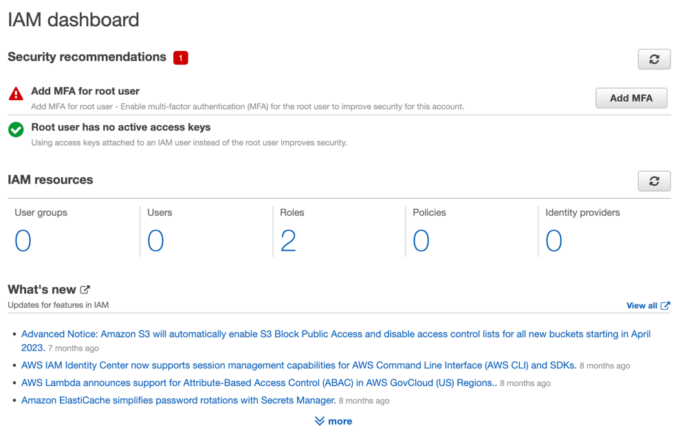
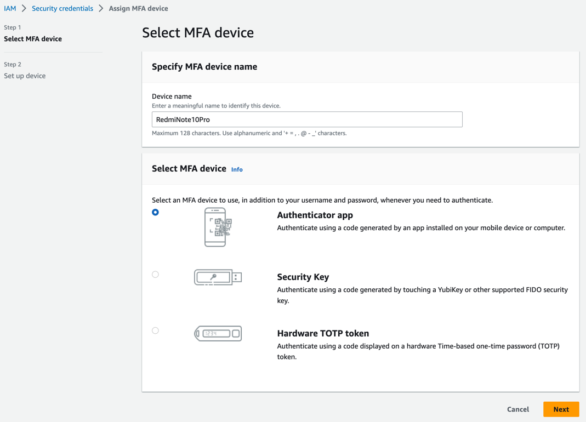
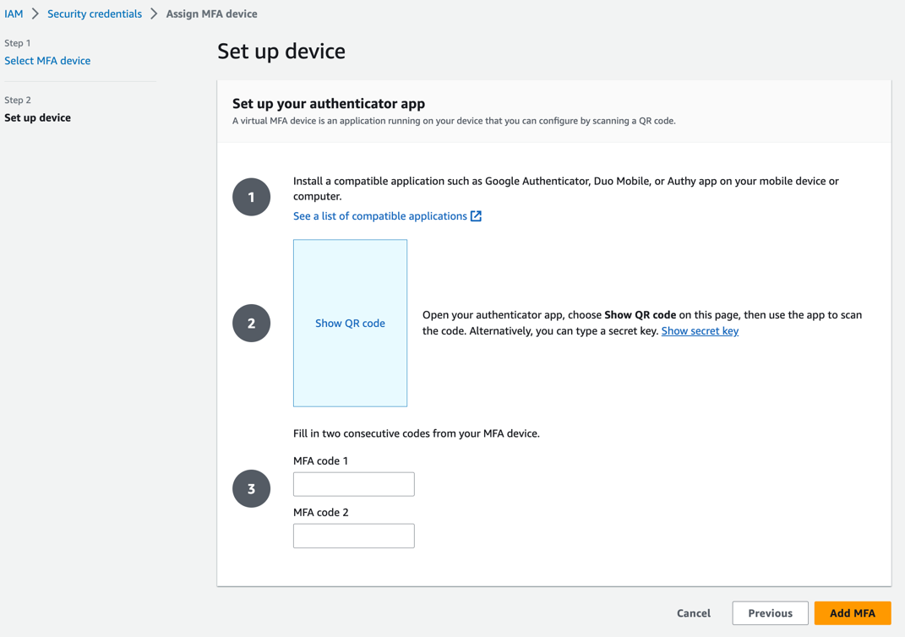
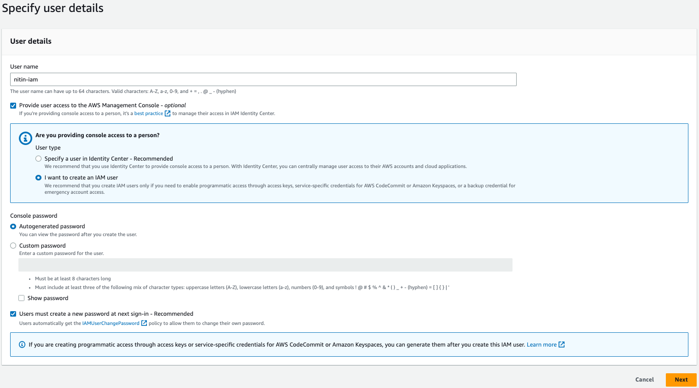
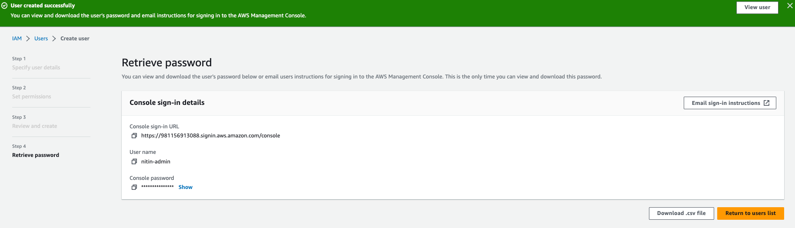
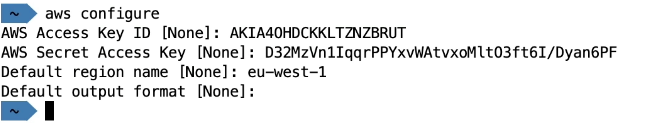

## Hands-On

## Steps to Activate MF

### Step 1: Go to IAM Section

### Step 2: Click on the Add MFA Security Recommendation and follow the wizard

---

## Create User

* Go to IAM
* Click on Users (on left menu)
* Click on add users
* Provide username
* Fill in details in the page shown below:
  
* On Successful User Creation
  

## IAM Policies Handson

## AWS CLI Configure

Go to user > Security Credentials > Create Access Key

In commandline use following command:
`aws configure` and provide your access key id, Secret Access Key, Default region, Default Output (just press enter)

you can try executing the command (if you have permissions): `aws iam list-users`

